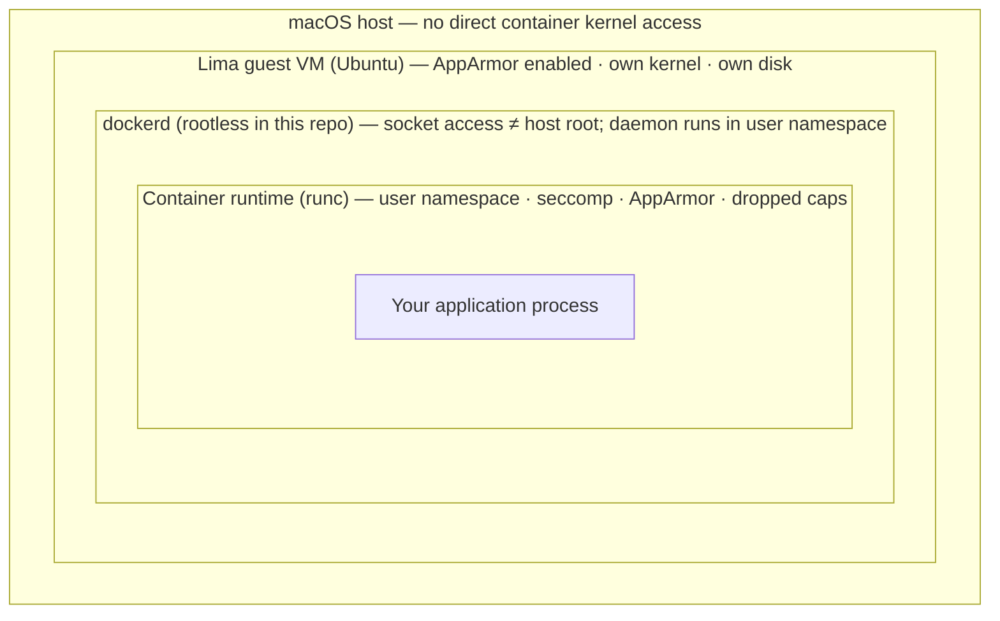

# Container Security: A Principal Engineer's Reference

How to harden a Docker container at runtime and at build time. This document assumes you are
running workloads inside the **Lima guest** provisioned by `lima-qemu-dockerd.yaml` (Ubuntu +
rootless dockerd), but every `docker run` flag and pattern here applies on any Linux host with
Docker Engine.

For AppArmor profile mechanics, see [`apparmor.md`](./apparmor.md). For why the daemon itself
runs unprivileged inside a VM, see [Rootless Docker in `lima.md`](./lima.md#7-rootless-docker-the-security-posture).

## Table of contents

- [0. Where security lives in the stack](#0-where-security-lives-in-the-stack)
- [1. Threat model](#1-threat-model)
- [2. Image and supply chain](#2-image-and-supply-chain)
- [3. Runtime hardening](#3-runtime-hardening)
- [4. Network isolation](#4-network-isolation)
- [5. Secrets and configuration](#5-secrets-and-configuration)
- [6. Compose and orchestrator manifests](#6-compose-and-orchestrator-manifests)
- [7. Verification and auditing](#7-verification-and-auditing)
- [8. Hardened example](#8-hardened-example)
- [9. Design-review checklist](#9-design-review-checklist)
- [See also](#see-also)

---

## 0. Where security lives in the stack

Containers are **not VMs**. Namespaces and cgroups provide process isolation, but the kernel
is still shared. Security is layered — each outer ring contains and constrains everything
inside it:



Each layer shrinks blast radius. A hardened container inside rootless dockerd inside a Lima VM
is materially safer than `--privileged` on a rootful daemon on bare metal — but **no layer
replaces the others**. Harden the container itself regardless of outer wrappers.

---

## 1. Threat model

Know what you are defending against:

| Threat | What helps |
|--------|------------|
| Compromised application (RCE, SSRF) | Non-root user, read-only rootfs, seccomp, AppArmor, network policies |
| Container escape to host | Drop `CAP_SYS_ADMIN`, no `--privileged`, keep kernel patched, LSM profiles |
| Lateral movement between containers | Custom bridge networks, no `--network host`, firewall rules in guest |
| Supply-chain compromise (malicious image/layer) | Pin digests, scan images, minimal base images, verify signatures |
| Data exfiltration via mounted volumes | Mount only what is needed, read-only where possible, never mount `docker.sock` |
| Denial of service | `--memory`, `--cpus`, `--pids-limit` |

**Non-goal:** containers cannot sandbox a workload that *requires* full kernel access (e.g. a
kernel module loader). Those belong on bare metal or a dedicated VM with a narrow scope — not in
a shared Docker host.

---

## 2. Image and supply chain

Security starts before `docker run`.

### Use minimal, pinned images

```bash
# Pin by digest, not just tag
docker pull nginx@sha256:abc123…

# Prefer slim or distroless bases over full OS images
# Good: gcr.io/distroless/static, debian:bookworm-slim, alpine:3.20
# Avoid: ubuntu:latest with 200+ packages you never use
```

### Build as non-root

```dockerfile
# Dockerfile — run the process as an unprivileged user
FROM debian:bookworm-slim
RUN groupadd -r app && useradd -r -g app -d /app -s /sbin/nologin app
COPY --chown=app:app . /app
USER app
WORKDIR /app
ENTRYPOINT ["./chatbot-app"]
```

### Scan before deploy

```bash
# inside the Lima guest
docker scout cves chatbot-app:latest          # Docker Scout (if enabled)
trivy image chatbot-app:latest                # Aqua Trivy — common in CI
```

### Do not bake secrets into images

Environment variables and `ARG` values end up in image history and layer caches. Inject secrets
at runtime (see [§5](#5-secrets-and-configuration)).

---

## 3. Runtime hardening

These are the highest-leverage `docker run` flags. Apply all that your workload can tolerate;
drop only what you have tested.

### Run as a non-root user

```bash
docker run --user 1000:1000 chatbot-app:latest
# or rely on the image's USER directive (preferred — enforced at build time)
```

Root inside a container is still root in the container's user namespace. Combined with a
misconfigured capability or kernel bug, that is unnecessary risk.

### Read-only root filesystem

```bash
docker run --read-only \
  --tmpfs /tmp:rw,noexec,nosuid,size=64m \
  --tmpfs /run:rw,nosuid,size=16m \
  chatbot-app:latest
```

Forces attackers who gain write access to stay in ephemeral tmpfs mounts instead of patching
binaries on the overlay layer.

### Drop Linux capabilities

Docker grants a default capability set. Drop everything you do not need, then add back surgically:

```bash
# Drop all, add only what the workload requires
docker run \
  --cap-drop ALL \
  --cap-add NET_BIND_SERVICE \
  chatbot-app:latest
```

| Capability | Risk if kept unnecessarily |
|------------|---------------------------|
| `CAP_SYS_ADMIN` | Near-equivalent to root; mount, namespace manipulation |
| `CAP_NET_RAW` | Raw sockets; ARP/DNS spoofing |
| `CAP_SYS_PTRACE` | Debug/trace other processes |
| `CAP_DAC_READ_SEARCH` | Bypass file read permission checks |

**Never use `--privileged`.** It grants every capability, disables seccomp, and disables
AppArmor confinement. It is for one-off debugging on a throwaway VM, not production.

### Seccomp

**Seccomp** — short for **secure computing mode** — is a Linux kernel facility that filters
which system calls a process may invoke. Docker applies a default seccomp profile (`default.json`)
that blocks ~40 dangerous syscalls.
Keep it unless you have a tested replacement:

```bash
# Default — always prefer this
docker run chatbot-app:latest

# Custom profile (must be a JSON file on the host, passed into the guest path)
docker run --security-opt seccomp=/path/to/custom.json chatbot-app:latest

# Unconfined — blocks nothing; avoid in production
docker run --security-opt seccomp=unconfined chatbot-app:latest
```

If a container fails with `Operation not permitted` on a specific syscall, **tighten a custom
profile** to allow that syscall — do not jump to `unconfined`.

### AppArmor

Docker applies the `docker-default` profile automatically inside the Lima guest. Override only
with a purpose-built profile:

```bash
docker run --security-opt apparmor=my-custom-profile chatbot-app:latest
```

See [`apparmor.md`](./apparmor.md) for profile authoring and the `docker-default` rule set.

### Resource limits

Prevent one container from starving the guest (or triggering OOM kills that take down neighbors):

```bash
docker run \
  --memory 512m \
  --memory-swap 512m \
  --cpus 1.0 \
  --pids-limit 100 \
  chatbot-app:latest
```

### Disable unnecessary kernel features

```bash
docker run \
  --security-opt no-new-privileges:true \
  chatbot-app:latest
```

`no-new-privileges` prevents a process from gaining more privileges via `setuid` binaries or
file capabilities — a common escalation path after an initial compromise.

### Volume mounts — least privilege

```bash
# Read-only application data
docker run -v /data/app:/data:ro chatbot-app:latest

# Never do this in production
docker run -v /var/run/docker.sock:/var/run/docker.sock chatbot-app:latest   # host takeover
docker run -v /:/host:rw chatbot-app:latest                                   # full host FS
```

Bind-mounting the project source from Lima's shared macOS mount (`/Users/...`) into a
container is fine for **development**; for anything resembling production, keep data on the
guest's native ext4 disk (see [`file-sharing.md`](./file-sharing.md)).

---

## 4. Network isolation

### Use a dedicated bridge network

```bash
docker network create app-net
docker run --network app-net --name api api:latest
docker run --network app-net --name db  postgres:16
```

Containers on the default bridge can reach each other by IP. A custom network gives you
name-based DNS and explicit membership.

### Avoid host networking unless required

```bash
# Exposes the container directly on the guest's network stack — no NAT, no port mapping
docker run --network host chatbot-app:latest   # rarely justified
```

Host networking removes network-namespace isolation. A compromised process can bind to ports
and sniff traffic on the guest's interfaces.

### Publish only the ports you need

```bash
docker run -p 127.0.0.1:8080:8080 chatbot-app:latest   # bind to guest loopback only
```

Inside Lima, published ports are forwarded to macOS via the Lima control plane. Binding to
`127.0.0.1` in the guest limits exposure to processes on the guest itself.

### Inter-container egress

For strict environments, attach containers to an **internal** network with no default route to
the internet, and route outbound traffic through an explicit proxy or sidecar.

---

## 5. Secrets and configuration

| Approach | Guidance |
|----------|----------|
| `docker run -e SECRET=…` | Visible in `docker inspect`, process env, `/proc/1/environ`. OK for local dev only. |
| Docker secrets (Swarm) | Encrypted at rest, mounted as files. Not available in plain `docker run`. |
| Bind-mounted secret files | `docker run -v /run/secrets/db-password:/run/secrets/db-password:ro` with mode `0400` on the host file. |
| External secret managers | Vault, AWS SM, 1Password Connect — fetch at entrypoint, never persist to disk. |

**Pattern:** read secrets from a file at startup, not from environment variables:

```bash
docker run \
  -v /run/secrets/token:/run/secrets/token:ro \
  -e SECRET_FILE=/run/secrets/token \
  chatbot-app:latest
```

---

## 6. Compose and orchestrator manifests

Translate the same principles into declarative config.

### Docker Compose (v3)

```yaml
services:
  api:
    image: myorg/api@sha256:abc123…
    read_only: true
    tmpfs:
      - /tmp:rw,noexec,nosuid,size=64m
    security_opt:
      - no-new-privileges:true
      - apparmor:docker-default
    cap_drop:
      - ALL
    cap_add:
      - NET_BIND_SERVICE
    user: "1000:1000"
    pids_limit: 100
    deploy:
      resources:
        limits:
          cpus: "1.0"
          memory: 512M
    networks:
      - backend
    # No published ports unless the service is an edge API

networks:
  backend:
    internal: false
```

### Kubernetes (sketch)

The same fields exist as `securityContext`, `resources.limits`, `readOnlyRootFilesystem`,
`allowPrivilegeEscalation: false`, `capabilities.drop: [ALL]`, and `seccompProfile:
{type: RuntimeDefault}`. AppArmor is covered in [`apparmor.md` §3](./apparmor.md#3-apparmor-and-kubernetes).

---

## 7. Verification and auditing

Run these inside the Lima guest after starting a container.

### Inspect effective security options

```bash
docker inspect --format '{{.HostConfig.SecurityOpt}}' mycontainer
docker inspect --format '{{.HostConfig.CapDrop}} {{.HostConfig.CapAdd}}' mycontainer
docker inspect --format '{{.HostConfig.ReadonlyRootfs}}' mycontainer
docker inspect --format '{{.Config.User}}' mycontainer
```

### Confirm AppArmor profile

```bash
docker inspect --format '{{.AppArmorProfile}}' mycontainer
# Expected: docker-default (or your custom profile name)
```

### Watch for LSM denials

```bash
# AppArmor denials land in the kernel log
sudo journalctl -k | grep -i apparmor | tail -20

# Or use auditd if installed
sudo ausearch -m AVC -ts recent
```

If a container works with `--privileged` but fails without it, **do not ship `--privileged`**.
Find the specific denial (AppArmor, seccomp, or missing capability) and fix it narrowly.

### Runtime process check

```bash
docker top mycontainer
# UID should not be 0 unless you have a documented reason
```

---

## 8. Hardened example

A production-shaped `docker run` for a stateless HTTP API inside the Lima guest:

```bash
docker run -d \
  --name api \
  --restart unless-stopped \
  --user 1000:1000 \
  --read-only \
  --tmpfs /tmp:rw,noexec,nosuid,size=64m \
  --security-opt no-new-privileges:true \
  --security-opt apparmor=docker-default \
  --cap-drop ALL \
  --cap-add NET_BIND_SERVICE \
  --memory 512m \
  --memory-swap 512m \
  --cpus 1.0 \
  --pids-limit 200 \
  -p 127.0.0.1:8080:8080 \
  --network app-net \
  myorg/api@sha256:abc123…
```

Adjust capabilities and tmpfs mounts after testing against the real workload. The structure —
non-root, read-only, dropped caps, resource limits, pinned digest, loopback bind — should be the
default you justify *away from*, not toward.

---

## 9. Design-review checklist

Use this as a gate before merging a container spec:

- [ ] Image pinned by digest; base image is minimal (slim/distroless)
- [ ] Dockerfile runs as non-root (`USER` directive)
- [ ] No `--privileged`, no `seccomp=unconfined`, no `apparmor=unconfined`
- [ ] Capabilities: `CAP_DROP ALL`, then minimal `CAP_ADD`
- [ ] Read-only root filesystem with explicit tmpfs for writable paths
- [ ] `no-new-privileges:true`
- [ ] Resource limits (memory, CPU, pids) set
- [ ] Only required volumes mounted; no `docker.sock`, no host `/` bind
- [ ] Network: custom bridge, no `--network host` unless documented
- [ ] Secrets not in env vars or image layers
- [ ] Image scanned (Trivy/Scout) with no critical CVEs unmitigated
- [ ] AppArmor / seccomp denials tested; failures fixed narrowly, not bypassed globally

---

## See also

- [`apparmor.md`](./apparmor.md) — AppArmor profiles, `docker-default`, custom profiles
- [`lima.md`](./lima.md) — rootless dockerd inside a VM, blast-radius reasoning
- [`file-sharing.md`](./file-sharing.md) — when bind-mounting macOS paths is a dev-only pattern
- [Docker Engine security](https://docs.docker.com/engine/security/)
- [CIS Docker Benchmark](https://www.cisecurity.org/benchmark/docker)
- [OWASP Docker Security Cheat Sheet](https://cheatsheetseries.owasp.org/cheatsheets/Docker_Security_Cheat_Sheet.html)
